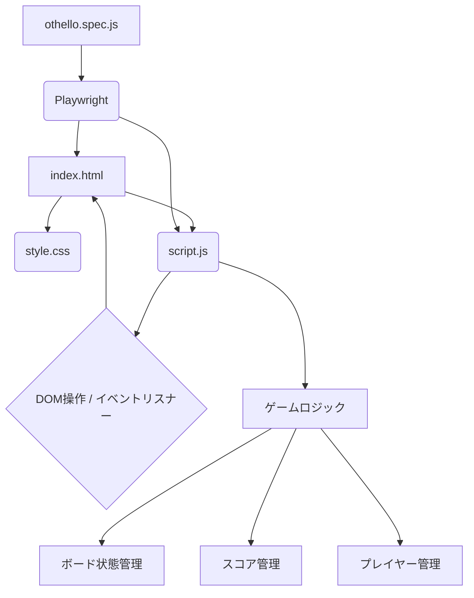

# オセロゲーム構成図

## 説明

*   **`index.html`**: ゲームの構造を定義するメインのHTMLファイルです。`style.css` を読み込み、`script.js` を実行します。
*   **`style.css`**: ゲームの見た目を定義するスタイルシートです。`index.html` に適用されます。
*   **`script.js`**: ゲームの主要なロジックを実装するJavaScriptファイルです。
    *   **DOM操作 / イベントリスナー**: `index.html` の要素を操作し、ユーザーイベント（クリックなど）を処理します。
    *   **ゲームロジック**: オセロのルール（駒の配置、反転、パス、ゲーム終了判定など）を実装します。
    *   **ボード状態管理**: ゲームボードの現在の状態を内部的に管理します。
    *   **スコア管理**: 黒と白のプレイヤーのスコアを管理し、表示を更新します。
    *   **プレイヤー管理**: 現在の手番のプレイヤーを管理し、表示を更新します。
*   **`othello.spec.js`**: Playwrightフレームワークを使用したE2Eテストコードです。
    *   **Playwright**: ブラウザを自動化し、`index.html` をロードして `script.js` のゲームロジックとUIのインタラクションをテストします。
